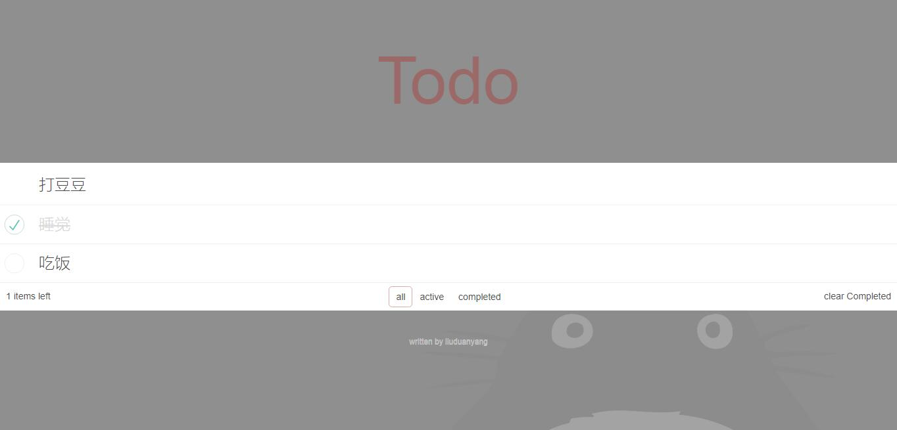

# simple-todo

* 使用webpack搭建工程流(loader、资源压缩合并、分离打包、设置缓存、资源压缩合并等)
* 使用webpack-dev-server搭建开发辅助工具
* 使用vue进行项目开发
* 尝试使用jsx

### 注意

在执行 `npm run build` 命令时，有些模块并不支持webpack4，所以应将package.json部分模块改为

	"extract-text-webpack-plugin": "^3.0.2",
	"webpack": "^3.10.0",
	"webpack-dev-server": "^2.9.7"

### 执行

npm run dev

### 展示

